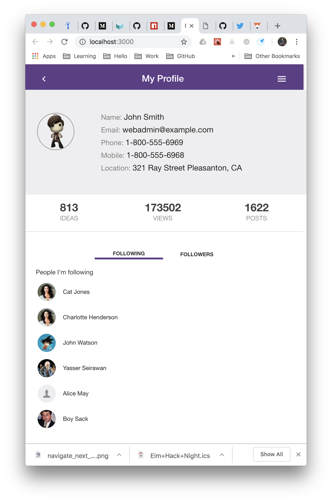

## Docker

The purpose of this repo is to show the use of Docker to manage a Frontend development project. Docker can organize different environment while sharing common resources like a databae or API server. The developer can mix and match frontend and services, giving them
a project where they can experiment and try out different solutions in a clean and controlled enviroment.

In the `docker/` directory there are three different front ends that can be use for this project, Angular, React and Polymer. The Angular project also runs a backend API in the docker machine.

Here is a cheatsheet for using Docker - https://github.com/kyledinh/docker/blob/master/dev-guide.md

| Frontends         | Details                             |
|-------------------|-------------------------------------|
| Angular           | Angular 7 and Datawasher API, app calls to two API sources |
| Polymer           | Polymer PWA, minimal development          |
| React             | Page/components built for local json call |

* Open source API written in Go: https://github.com/kyledinh/datawasher

## Angular Container

This is the furthest built out Front end and it deploys the Datawasher API as a docker container as a data source

See notes in `docker/readme.md`

## React Container

Use `docker/react-app/ssh-container.ssh` to ssh into the Polymer container. The `app/` directory is mapped to the container's `/usr/src/app/` directory.

### React Commands

* `npm install` to install/reinstall node dependencies
* `npm run build`
* `npm run serve` will serve build directory
* Browse to `http://127.0.0.1:3000/`

## Polymer Container

Use `docker/polymer-app/ssh-container.ssh` to ssh into the Polymer container. The `app/` directory is mapped to the container's `/usr/src/app/` directory.

In the container you have a Node 10 environment with the Polymer CLI.

* To run the es6 build `polymer-app/serve-build-es6.sh` and navigate brower to `http://127.0.0.1:8000/`

### Polymer Commands

* `npm install` to install/reinstall node dependencies
* `npm run build`
* `npm test`
* `npm start build/es6-bundled`

To start a new project use

* `polymer init polymer-3-starter-kit`

## Screenshot of React version

## References

* https://developers.google.com/web/progressive-web-apps/
* https://www.polymer-project.org/3.0/start/install-3-0
* https://github.com/lopezator/hello-docker-react
* https://github.com/kyledinh/docker/blob/master/dev-guide.md
